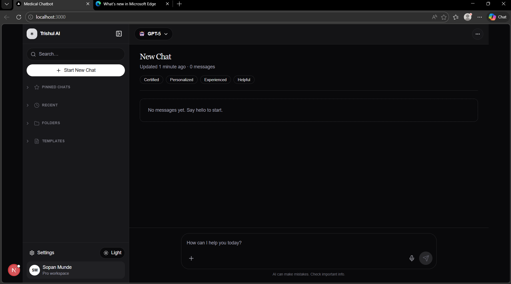
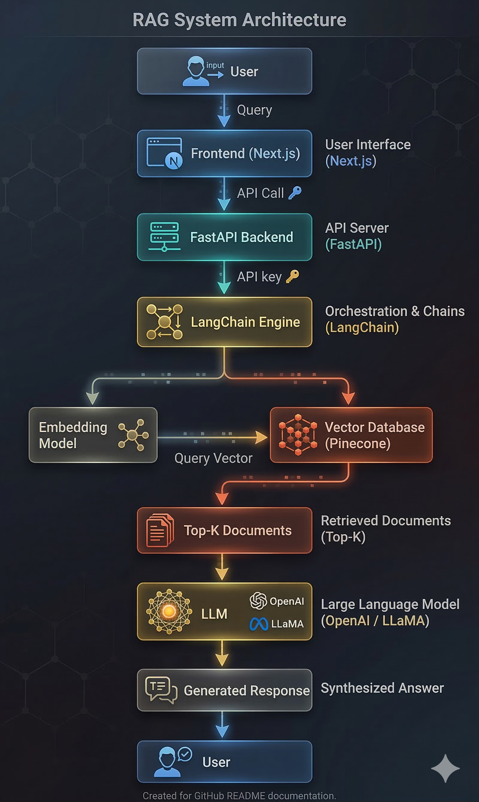

# 🩺 Trishul-AI Medical Chatbot

An AI-powered medical chatbot built using **Retrieval-Augmented Generation (RAG)** that provides context-aware, non-diagnostic responses by retrieving relevant medical information from a vector database.

---

## 🚀 Overview

Trishul-AI is designed to assist users with general medical queries by combining **semantic search** and **Large Language Models (LLMs)**.  
The system retrieves relevant medical documents and generates safe, contextual responses.

---

## 🎯 Problem Statement

Accessing reliable medical information quickly can be challenging.  
This project aims to provide **accurate, context-aware, and safe responses** using AI without replacing professional medical advice.

---

## ✨ Features

- 🔍 Retrieval-Augmented Generation (RAG)
- 🧠 Semantic search using vector embeddings
- ⚡ FastAPI backend for real-time AI inference
- 💬 Context-aware chatbot responses
- 🔐 Authentication-enabled frontend (Next.js)
- 📊 Handles large-scale medical document datasets
- ⚠️ Built-in medical disclaimers for safe usage

---

# Chatbot UI




## 🛠️ Tech Stack

### AI / ML
- LangChain
- OpenAI API / LLaMA
- NLP techniques

### Backend
- FastAPI
- Python

### Frontend
- Next.js
- Clerk Authentication

### Database
- Pinecone (Vector Database)

### Tools
- Pandas, NumPy
- Git, GitHub

---

## 🧠 System Architecture

The system follows a **Retrieval-Augmented Generation (RAG)** pipeline combining semantic search with LLM-based response generation.

### 🔄 Architecture Flow

User Query  
↓  
Frontend (Next.js UI)  
↓  
FastAPI Backend (API Layer)  
↓  
LangChain Orchestrator  
↓  
Embedding Model (Text → Vector)  
↓  
Pinecone Vector Database (Similarity Search)  
↓  
Top-K Relevant Documents Retrieved  
↓  
LLM (OpenAI / LLaMA)  
↓  
Context-Aware Response Generation  
↓  
Response Sent to User  

---

## Architecture Diagram



## 📊 Dataset

- 📄 3,000+ medical documents
- Sources: publicly available medical articles and guidelines
- Preprocessing:
  - Text cleaning
  - Tokenization
  - Chunking
  - Embedding generation

---

## ⚡ Performance Metrics

- 🎯 Retrieval Accuracy: ~85%  
- ⏱️ API Response Latency: <2 seconds  
- 👥 Tested with: 50+ users  
- 📈 Optimized vector search for faster retrieval  

---

---

## ⚙️ Installation & Setup

### 1️⃣ Clone Repository

```bash
git clone https://github.com/your-username/trishul-ai-medical-chatbot.git
cd trishul-ai-medical-chatbot

```

### Backend Setup

```bash
cd backend
pip install -r requirements.txt
```

# Environment Varibles

```bash
GEMINI_API_KEY=your_api_key
PINECONE_API_KEY=your_api_key
```
# Run Backend Server

```bash
uvicorn app:app --reload
```
Backend run at:

       http://127.0.0.1:8000

# Frontend Setup
```bash
cd ../frontend/nextjs-app
npm install
npm run dev
```
Frontend Run at: 
        http://localhost:3000


Author
Sopan Munde
E-mail: sopanmunde5@gmail.com
Portfolio: https://my-portfolio-liard-xi-19.vercel.app/